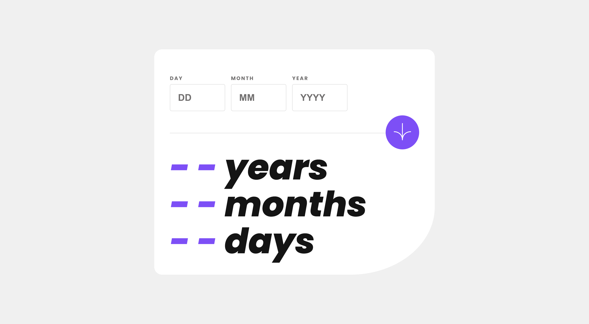

# Frontend Mentor - Age calculator app solution

This is a solution to the [Age calculator app challenge on Frontend Mentor](https://www.frontendmentor.io/challenges/age-calculator-app-dF9DFFpj-Q). Frontend Mentor challenges help you improve your coding skills by building realistic projects. 

## Table of contents

- [Overview](#overview)
  - [The challenge](#the-challenge)
  - [Screenshot](#screenshot)
  - [Links](#links)
- [My process](#my-process)
  - [Built with](#built-with)
  - [What I learned](#what-i-learned)

## Overview

### The challenge

Users should be able to:

- View an age in years, months, and days after submitting a valid date through the form
- Receive validation errors if:
  - Any field is empty when the form is submitted
  - The day number is not between 1-31
  - The month number is not between 1-12
  - The year is in the future
  - The date is invalid e.g. 31/04/1991 (there are 30 days in April)
- View the optimal layout for the interface depending on their device's screen size
- See hover and focus states for all interactive elements on the page
- **Bonus**: See the age numbers animate to their final number when the form is submitted

### Screenshot



### Links

- Solution URL: [Add solution URL here](https://github.com/msalvatore22/Age-Calculator)
- Live Site URL: [Add live site URL here](https://msalvatore22.github.io/Age-Calculator/)

## My process

### Built with

- Semantic HTML5 markup
- CSS custom properties
- Flexbox
- [React](https://reactjs.org/) - JS UI Library
- [Moment.js](https://momentjs.com/) - JS Date Library
- [Vite](https://vitejs.dev/) - JS Build Tool

### What I learned

* Custom input validations using react state
* Dynamic styling
* Calculating age using Moment.js
* Media Queries for mobile styles

Dynamic input styling based on input validations
```js
let inputStyle = {
  border: input.invalid || input.empty ? '1px solid hsl(0, 100%, 67%)' : '1px solid hsl(0, 0%, 86%)'
}

let labelStyle = {
  color: input.invalid || input.empty ? 'hsl(0, 100%, 67%)' : 'hsl(0, 1%, 44%)' 
}
```
